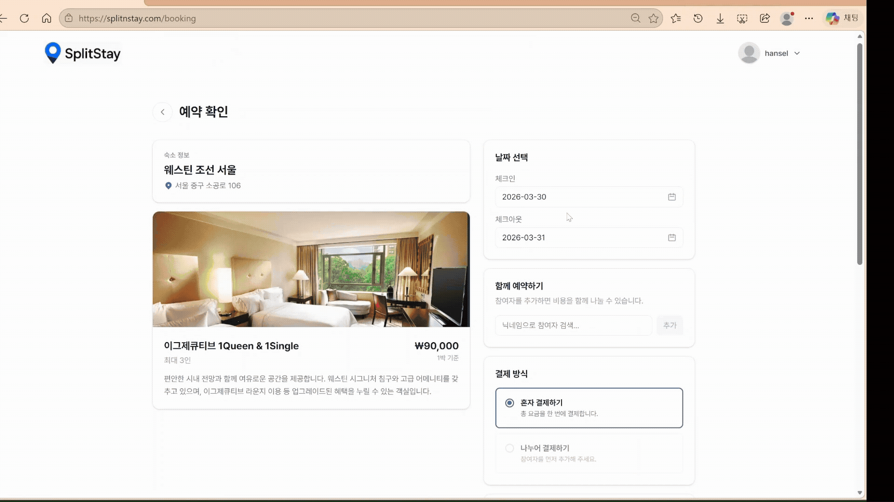
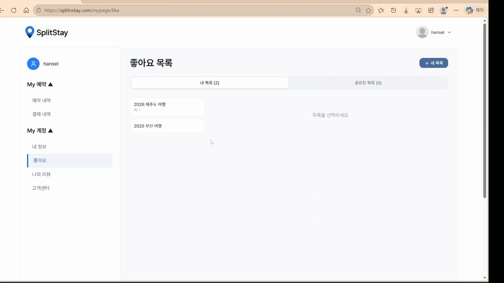

# 호텔 예약 플랫폼 SplitStay

목차
1. [프로젝트 소개](#프로젝트-소개)
2. [배포 주소 및 계정](#배포-주소-및-계정)
3. [프론트엔드 데모](#프론트엔드-데모)
4. [System Architecture](#system-architecture)
5. [ERD](#erd)
6. [주요 기술 스택](#주요-기술-스택)
7. [기술적 이슈  해결 과정](#기술적-이슈--해결-과정)

 

## 프로젝트 소개
- 친구들과 함께 호텔 즐겨찾기 리스트를 공유하고, 결제도 1/n로 나누어서 할 수 있는 호텔 예약 플랫폼입니다.
- 기존 호텔 예약 서비스는 개인 중심으로 설계되어 있어, 그룹 여행 시 비용 정산과 의사결정 과정이 번거롭다는 문제를 해결하고자 개발했습니다. 

## 배포 주소 및 계정
|         | 주소                                             |
|---------|------------------------------------------------|
|프론트엔드 주소| https://splitnstay.com|
|백엔드 API 주소     | https://api.splitnstay.com                                        |
| swagger | https://api.splitnstay.com/swagger-ui/index.html |

 

| 사용자 타입 | username         | password   |
|--------|------------------|------------|
| 손님     | hansel@gmail.com | demoGuest1 |
| 호텔 관리인    | westinChosun@gmail.com     | demoHotel1 |

 

## 프론트엔드 데모

#### 호텔 검색

 

#### 예약 및 결제

 

#### 다른 사용자와 좋아요 목록 공유 

 

## System Architecture

 
 

 

## ERD

 

## 주요 기술 스택

Backend
- **Java 17**
- **Spring Boot 3.5.0**
- **Spring Data JPA** 
- **QueryDSL** (동적 검색 조건 및 타입 안전 쿼리)

Frontend
- **React + Vite**
- **AWS S3 + CloudFront**
  - S3를 정적 파일 저장소로 사용
  - CloundFront를 통해 CDN 기반 글로벌 캐싱 및 성능 최적화

Database
- **AWS RDS MySQL 8.0**
  - DB 서버를 EC2와 분리하여 관리
  - 복합 인덱스 설계 및 실행 계획 분석
- **Redis** 
  - Refresh Token 저장
  - 캐싱 전략 적용

Infrastructure & DevOps
- **AWS EC2** (Docker 기반으로 Spring Boot, Redis 컨테이너 운영)
- **Docker / Docker Compose** (서비스 컨테이너화 및 환경 일관성 확보)
- **NGINX** (Reverse Proxy 및 포트 관리)
- **GitHub Actions** (CI/CD 자동화 배포)

Networking & Storage
- **AWS Route 53** (도메인 구매 및 DNS 설정)
- **AWS CloudFront + ACM** (AWS ACM 기반 HTTPS 적용)
- **AWS S3** (사용자 업로드 이미지 저장소)

Performance & Testing
- **k6** (부하 테스트, p95 응답 시간 측정 및 성능 개선 효과 검증)
 

---
## 기술적 이슈  해결 과정
 

***[#1] 호텔 검색 API 성능 개선하기***
1) [***리팩토링이 필요했던 이유***](https://www.notion.so/kimdevlog/2afe5677f7ab80ceacbcc794294001e0)  
    Fetch Join으로 데이터가 뻥튀기 되고, 정렬/페이징을 메모리에서 처리하던 구조의 문제점을 발견했습니다.
  

2) [***Haversine 대신 ST_DISANCE_SPHERE() 사용하기***](https://www.notion.so/kimdevlog/Haversine-MySQL-ST_DISTANCE_SPHERE-2bfe5677f7ab80deb005fbd8f49f4aa7)  
    거리 계산, 정렬, 페이징을 애플리케이션 서버가 아니라 DB에서 하도록 했습니다.
  
3) (트러블슈팅) [***Bounding Box가 없다면 어떻게 될까? Index는 있지만 적용하지 못하는 문제 해결***](https://www.notion.so/kimdevlog/Bounding-Box-Index-2cbe5677f7ab80029380daae334f9982)  
    EXPLAIN ANALYZE로 왜 옵티마이저가 인덱스가 있는데도 사용하지 않았는지, 그리고 강제로 사용해도 손해였는지 원인을 찾아서 Bounding Box 적용으로 해결했습니다.  
    Bounding Box는 검색 반경을 감싸는 최소 면적의 사각형입니다. 이 프로젝트에서는 현재 위치 기준으로 Bounding Box를 계산해 BETWEEN latitude/longitude 쿼리를 사용해 거리 계산을 해야 하는 호텔을 줄였습니다.  
 

4) [***k6로 VU임계점 찾고, 리팩토링 전후 성능 테스트***](https://www.notion.so/kimdevlog/K6-VU-2cbe5677f7ab8065a4eae4b1e5df3a61)  
    stages를 통해 VU의 hard threshold와 soft threshold를 찾은 후, p95 < 300ms를 만족하는 VU에서 전후 비교 

 

***[#2] 호텔 검색 API에서 발생하는 N + 1 문제 해결***

[***호텔 검색 API에서 발생하는 N + 1문제 batch size 설정으로 해결하기***](https://www.notion.so/kimdevlog/API-N-1-batch-size-2cae5677f7ab807baed6c865060f36b5#2cae5677f7ab808fa7e6f86e2b5b3452)  

 

***[#3] 예약 API - 언제 제고를 차감해야할까? 초기 Redis 기반 구현에서 Status 관리로 Race Condition 해결하기***

[***예약 시스템 - 언제 재고를 차감해야 할까?***](https://www.notion.so/kimdevlog/227e5677f7ab80428b28ce75517c91c1)

  
